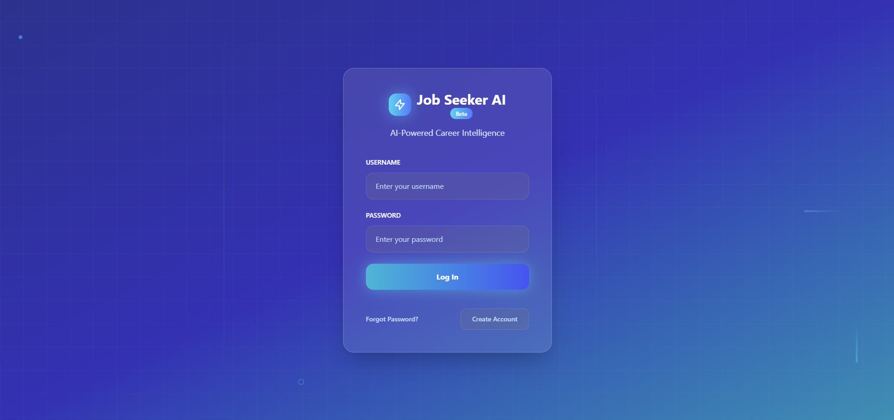
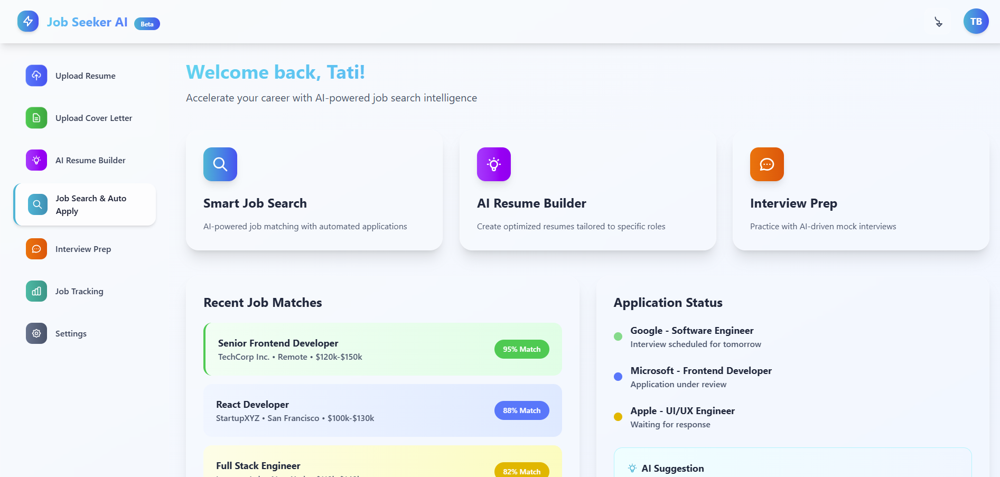

# JobSeeker AI  

**Status:** MVP in progress (Code private during SaaS productization)  
**Owner:** Tatiana Brimm • NeveraTech  

JobSeeker AI is a privacy-first career assistant that helps job seekers tailor their resumes, cover letters, and interview prep to each role — without relying on unsafe scraping or spammy automation.  

---

## ✨ Features (Planned MVP)  
- **Smart Resume Parser** – Upload or paste your resume → structured profile  
- **Job Description Analyzer** – Extracts keywords, skills, and seniority level  
- **AI Resume Builder** – Generates job-specific bullet points  
- **Cover Letter Drafts** – Clear, professional letters in one click  
- **Interview Prep** – Personalized questions to practice  
- **Job Tracker** – Track applications and AI follow-up reminders  

---

## 🖼️ Screenshots  

### Login  
  

### Dashboard  
  

---

## 🧱 Tech Stack  
- **Frontend:** Tailwind + HTML/CSS (React planned)  
- **Backend:** FastAPI (Python)  
- **Database (planned):** Supabase/Postgres  
- **AI Models:** OpenAI (pluggable, privacy-safe)  

---

## 🗺️ Roadmap  
**MVP (Fall 2025):**  
- [ ] Resume → JSON profile parser  
- [ ] Job Description analyzer  
- [ ] Resume bullets + cover letter drafts  
- [ ] Simple PDF/Docx export  
- [ ] Local job tracker  

**Phase 2:**  
- [ ] Supabase Auth + secure storage  
- [ ] React frontend  
- [ ] Interview prep module  

**Phase 3:**  
- [ ] Company research briefs  
- [ ] Salary benchmarks + negotiation tips  

---

## 🔐 Why Private Code?  
This project is being developed into a SaaS product.  
The production codebase is private to protect intellectual property and security.  

👉 You can follow updates and learn more on my [Portfolio Website](https://your-portfolio-link.com/projects/jobseeker-ai).  

---

## 📄 License  
This repository is for **showcase purposes only**.  
All rights reserved © 2025 Tatiana Brimm / NeveraTech.  
